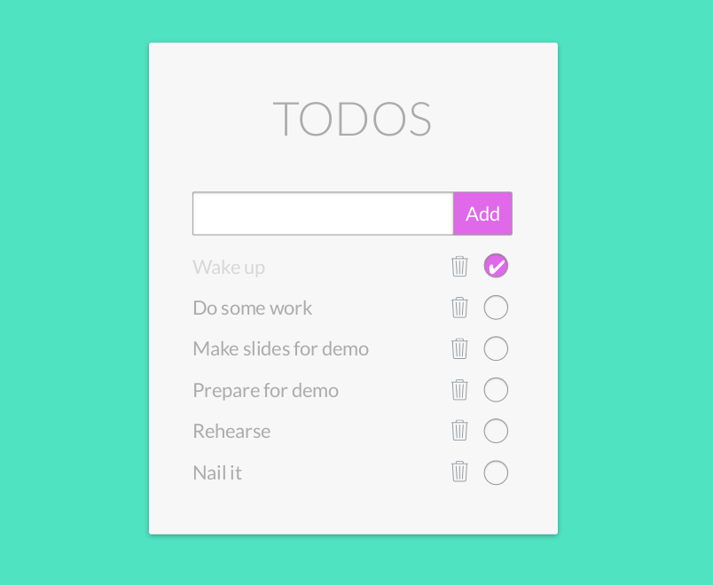

# Full stack TODO application

You can practice everything you've learnt during the JavaScript orientation
period with this full stack exercise to deepen your knowledge.

## The project

Create a full stack todo application with database with the aim to get, store
todos in a database.

The user should have access to her/his data, manipulate it by updating or
deleting it.

As a general advice, don't spend too much time with the UI, rather concentrate
on the functionality.

The main focus should be to practice the client-server communication, sending
and receiving proper http requests and building/handling database. In addition,
writing tests where they are really needed.

## Specification

[**Frontend**](./documentation/todo-frontend.md)\
[**Backend**](./documentation/todo-backend.md)

## Extras

These things are not mandatory, but rather cool ideas if you have more time and
will to figure out and implement.

- Create a unique design
- Add opportunity to tag todos (topic, priority...)
- Add opportunity to create deadlines
- Filter todos by keyword
- Add parent - child todos
- Reorder todos by drag and drop
- Export todos in CSV
- Share todos online